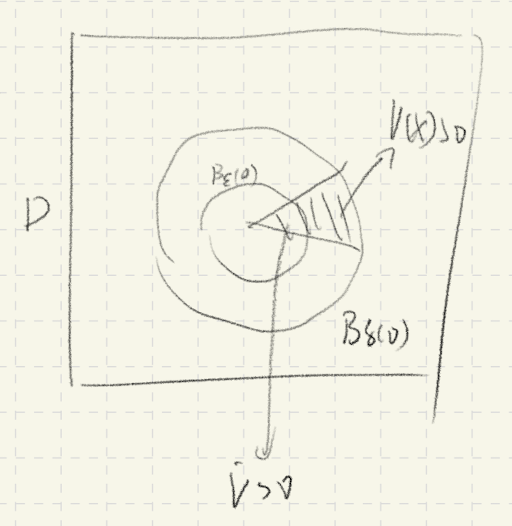
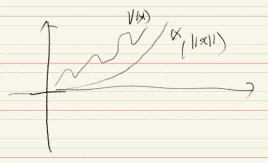
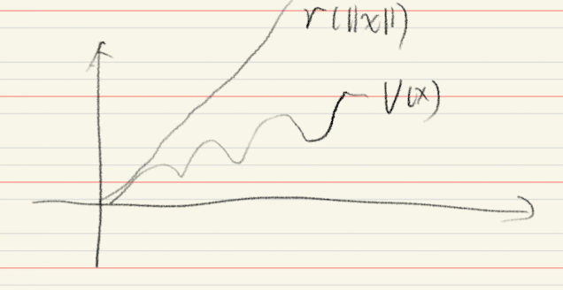
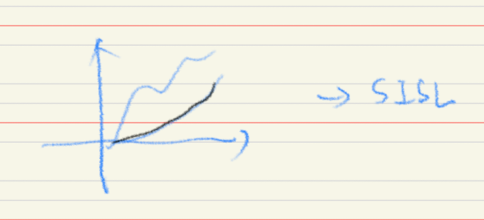
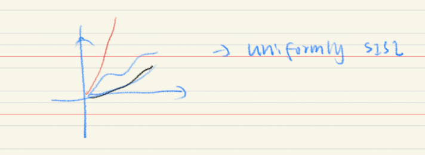
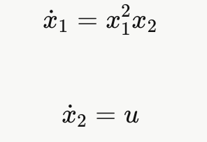
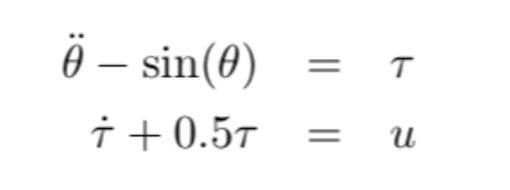

# ""NONLINEAR SYSTEMS — COMPLETE NOTES""

**ESSENTIAL MATRIX DERIVATIVE RULES**

| Matrix type | Form | Eigenvalues | Quick rule |
|---|---|---|---|
| **Diagonal** | `diag(a, d)` | $\lambda_1=a,\ \lambda_2=d$ | Read off diagonal directly |
| **Upper triangular** | $\begin{bmatrix} a & b \\ 0 & d \end{bmatrix}$ | $\lambda_1=a,\ \lambda_2=d$ | Read off diagonal, ignore $b$ |
| **Lower triangular** | $\begin{bmatrix} a & 0 \\ c & d \end{bmatrix}$ | $\lambda_1=a,\ \lambda_2=d$ | Read off diagonal, ignore $c$ |
| **Anti-diagonal** | $\begin{bmatrix} 0 & b \\ c & 0 \end{bmatrix}$ | $\lambda=\pm\sqrt{bc}$ | $bc>0$: real saddle; $bc<0$: imaginary center |
| **General $2\times2$** | $\begin{bmatrix} a & b \\ c & d \end{bmatrix}$ | $\lambda^2-\text{tr}\,\lambda+\det=0$ | Use trace & determinant |
| **Diagonal/Triangular $3\times3$** | $\begin{bmatrix} a & * & * \\ 0 & d & * \\ 0 & 0 & f \end{bmatrix}$ | $\lambda_1=a,\ \lambda_2=d,\ \lambda_3=f$ | Read off diagonal directly |
| **Anti-diagonal $3\times3$** | $\begin{bmatrix} 0 & 0 & c \\ 0 & d & 0 \\ e & 0 & 0 \end{bmatrix}$ | $\lambda_1=d,\ \lambda_{2,3}=\pm\sqrt{ce}$ | Middle entry gives one $\lambda$; corner pair interact |

1.Derivative of a Transpose

Let $X = X(t)$.

$$
\frac{d}{dt}(X^\top)
=
\left(\frac{dX}{dt}\right)^\top
$$

2.Matrix Product Rule

$$
\frac{d}{dt}(XY)
=
\dot X Y + X \dot Y
$$

3.Quadratic Form

Let

$$
V(x) = x^\top A x
$$

Then

$$
\nabla V(x) = (A + A^\top)x
$$

If $A = A^\top$,

$$
\nabla V(x) = 2Ax
$$

4.Chain Rule (Lyapunov Use)

For

$$
\dot x = f(x)
$$

$$
\dot V(x)
=
\nabla V(x)^\top f(x)
$$

## 1. Linear Systems

A linear time-invariant system:

System:

$$
\dot{x} = A x
$$

Solution:

$$
x(t) = e^{At} x(0)
$$

The stability of the system is determined by the eigenvalues $\lambda_i$ of $A$.

- $\operatorname{Re}(\lambda_i) < 0$ for all $i$ $\Rightarrow$ **asymptotically stable**

- $\operatorname{Re}(\lambda_i) > 0$ for some $i$ $\Rightarrow$ **unstable**

- $\operatorname{Re}(\lambda_i) = 0$ for some $i$
  - if the eigenvalues on the imaginary axis are **simple** $\Rightarrow$ Lyapunov stable
  - otherwise $\Rightarrow$ unstable

Properties of linear systems:

- Superposition principle holds  
- The equilibrium is typically unique: $x = 0$  
- No limit cycles exist  
- The global behavior is completely determined by the spectrum of $A$

**1.1 limit cycle**

A limit cycle is an isolated periodic orbit of a nonlinear autonomous system

$$
\dot{x} = f(x)
$$

A trajectory $\gamma $ is a limit cycle if

- it is **periodic**
- there are no other periodic orbits arbitrarily close to it

Nearby trajectories may approach the orbit (stable), move away from it (unstable), or approach from one side only (semi-stable).

Limit cycles do not occur in linear systems.

---

Example

Consider the system in **polar coordinates**

$$
\dot R = -R(R^2-1), \qquad \dot \theta = 1
$$

Radial equilibria satisfy

$$
\dot R = 0 \Rightarrow R = 0,\; R = 1
$$

For $0<R<1$, $\dot R > 0 $ so the radius increases.  
For $R>1$, $ \dot R < 0 $ so the radius decreases.

Thus trajectories move toward R=1 while $\theta $ keeps rotating.

The circle

$$
R = 1
$$

is therefore a stable limit cycle.
you can have unstable one too if you like

---

## 2. Nonlinear Systems

General nonlinear autonomous system:

$$
\dot{x} = f(x)
$$

Equilibria satisfy:

$$
f(x_e) = 0
$$

Nonlinear systems may exhibit:

- Multiple equilibria  
- Limit cycles  
- Bifurcations  
- Finite escape time  
- Complex attractors  

Superposition does not hold:

$$
f(x_1 + x_2) \neq f(x_1) + f(x_2)
$$

Behavior depends on geometry of the vector field.

## 3. Normed Spaces

A norm satisfies:

1. $\Vert x\Vert  \ge 0$, and $\Vert x\Vert =0 \iff x=0$  
2. $\vert\alpha x\vert = \vert\alpha\vert\vert x\vert$  
3. $\Vert x+y\Vert  \le \Vert x\Vert +\Vert y\Vert $  

Common norms in $\mathbb{R}^n$:

$$\Vert x\Vert _2 = \sqrt{x^\top x}, \quad$$
$$\Vert x\Vert _1 = \sum |x_i|, \quad$$
$$\Vert x\Vert _\infty = \max_i |x_i|$$

All norms are equivalent in finite dimensions.

---

## 4. Completeness

A sequence converges if:

$$
\Vert x_n - x\Vert  \to 0
$$

(in strict definition: every 
ε>0, there exists an integer 
N such that for all 
n≥N
the above <ε)

A sequence is Cauchy if:

$$
\Vert x_n - x_m\Vert  \to 0 \quad \text{as } n,m \to \infty
$$

A space is **complete** if every Cauchy sequence converges in that space.

actually in $\mathbb{R}$ , every cauthy seq is converged.

A complete normed space is called a Banach space.

Completeness is required for fixed-point theorems.

---

## 5. Contraction Mapping

A mapping $P$ is a contraction if:

$$
\Vert P(x)-P(y)\Vert  \le L \Vert x-y\Vert , \quad 0 \le L < 1
$$

**Banach Fixed-Point Theorem**

If $P$ is a contraction on a complete space:

- A unique fixed point exists  
- x is cauthy and iteration converges to fixed point $x^*$

## 6. Integral Form of ODE

Given:

$$
\dot{x} = f(t,x), \quad x(t_0)=x_0
$$

Integral form:

$$
x(t)=x_0+\int_{t_0}^{t} f(s,x(s))\,ds
$$

Define operator:

$$
(Px)(t)=x_0+\int_{t_0}^{t} f(s,x(s))\,ds
$$

Solving the ODE is equivalent to solving:

$$
Px = x
$$

Thus the ODE becomes a fixed-point problem.

---

## 7. Lipschitz Continuity

Global Lipschitz:

$$
\Vert f(x)-f(y)\Vert  \le L \Vert x-y\Vert 
$$

Local Lipschitz guarantees local existence and uniqueness.(with p.w. continuity)
> piecewise continuity looks like not continued

Global Lipschitz guarantees global existence (the condition for **no finite escape time**).

- you can actually take the derivative of the **linear system**, then the answer is the lipschitz constant
- lipschitz continuity $\rightarrow $ continuity

---

## 8. Finite Escape Time

Example:

$$
\dot{x} = 1 + x^2
$$

Solution:

$$
x(t)=\tan t
$$

Blow-up occurs at:

$$
t=\frac{\pi}{2}
$$

Conclusion:

- Local Lipschitz ⇒ local solution  
- Global growth control ⇒ global solution  

linear system does not have a finite escape time because the derivatives always a constant, so it is globally lipschitz $\rightarrow$ no finite escape time

---

## 9. Grönwall Inequality

If

$$
u(t) \le C + \int_{t_0}^{t} a(s) u(s)\,ds
$$

Then

$$
u(t) \le C \exp\!\left(\int_{t_0}^{t} a(s)\,ds\right)
$$

Used for:

- Continuous dependence on IC
- Growth bounds

---

## 10. Continuous Dependence on IC (Initial Conditions)

Four questions for nonlinear system:
1. solution exist?
2. solution unique?
3. have finite escape time?
4. continuous on IC?

Consider

$$
\dot{x} = f(t,x), \quad x(t_0)=x_0
$$

Assume:

- $f$ is continuous in $t$  
- $f$ is **locally Lipschitz** in $x$  

Then solutions depend continuously on the initial condition.

More precisely:

For $\forall$  $T>t_0$ and $\forall$ $\varepsilon>0$, there $\exists$ $\delta>0$ such that

$$
\Vert x_0 - y_0\Vert  < \delta
\Rightarrow
\sup_{t \in [t_0,T]}
\Vert x(t,x_0) - x(t,y_0)\Vert  < \varepsilon
$$

This means small perturbations in the initial condition produce small changes in the entire trajectory over finite time intervals.

---

# ""STABILITY THEORY""

## 11. Equilibrium

$$
f(x_e)=0
$$

---

## 12. Compactness

Close + bounded = compact

Example: [0,1]

---

## 13. Lyapunov Stability

Stable if:

For $\forall$ $\varepsilon>0$, there $\exists$ $\delta>0$ such that

$$
\Vert x(0)-x_e\Vert <\delta
\Rightarrow
\Vert x(t)-x_e\Vert <\varepsilon
$$

(Note: $t$ means any time $t \ge 0$, not $t \to \infty$)

Asymptotically stable if additionally:

$$
x(t)\to x_e
$$

## 14. Lyapunov Direct Method

A scalar function $V(x)$ ( Lyapunov function )satisfies:

- $V(x)>0$ for $x\neq 0$  
- $V(0)=0$  

Derivative along trajectories:(basically $\dot x = f(x)$)

$$
\dot{V}(x)=\nabla V(x)^\top f(x)
$$

If

$$
\dot{V}(x)\le 0
$$

→ Stable.

If

$$
\dot{V}(x)<0
$$

→ Asymptotically stable.

> intuition:
> 

> 
> 

---

## 15. Global AS and LaSalle Theorem

If:

- $V(x)>0$  
- $\dot{V}(x)\le 0$  
- $V(x)\to \infty$  
as $x \to \infty$ (radially unbounded)

Then we say it is globally AS
(remember the picture Prof draw in class)

**LaSalle Thm**
preset 

- SISL
- let $\mathcal{S}'= \{x\in D \mid \dot V(x)=0 \} $, if the only solution of the system dynamics within S is x(t)=$x_e$ = 0

then $x_e$ is AS

S is invariance set,  in set S the $\dot{V} =0$, the other region in D is $\dot{V} <0$

this basically says the point will fall downward and fix only to the origin

---

## 16. Instability Theorem (Chetaev)

If:

- $V(0)=0$  
- $V(x)>0$  
- $\dot{V}(x)>0$  in a wedged region

or say: 

in some point in the $B_\delta(X_e) $ $V(x)>0$, 

and $\exists \varepsilon$ s.t. all $\dot{V}(x)$ >0 in this \{ $B_\epsilon(X_e)$ $\vert$ $V(x)>0$ \}

Then equilibrium is unstable.

{: width="25%" }

## 17. Lyapunov Equation

For the linearized system
$$
\dot{x} = A(x - x_e),
$$

consider the quadratic Lyapunov function

$$
V(x) = (x - x_e)^{\top} P (x - x_e),
$$

where $P = P^{\top} > 0$.

The matrix $P$ satisfies the Lyapunov equation

$$
A^{\top} P + P A = -Q,
$$

where $Q = Q^{\top} > 0$. You can just assign $I$

If such a positive definite $P$ exists, then the equilibrium $x_e$ is locally asymptotically stable.

because the Lyapunov Equation makes 

$$
\dot{V} (x)= (x - x_e)^{\top} Q (x - x_e)<0
$$

---

## 18. Linearization

Linearization matrix:

$$
A = \frac{\partial f}{\partial x}\Big|_{x_e}
$$

Approximation:

$$
\dot{x} \approx A(x-x_e)
$$

**Linearization Example (Equilibrium Not at Origin)**

Consider the nonlinear system

$$
\begin{cases}
\dot x_1 = x_2 \\
\dot x_2 = -x_1 + 1 - (x_1 - 1)^3
\end{cases}
$$

---

**1. Equilibrium**

Solve

$$
x_2 = 0, \quad -x_1 + 1 - (x_1 - 1)^3 = 0
$$

We obtain

$$
x_e = (1,0).
$$

---

**2. Jacobian**

Let  

$$
f_1 = x_2, \quad
f_2 = -x_1 + 1 - (x_1 - 1)^3.
$$

Then

$$
A(x) =
\begin{bmatrix}
0 & 1 \\
-1 - 3(x_1 - 1)^2 & 0
\end{bmatrix}.
$$

Evaluate at $x_e = (1,0) $:

$$
J(x) =
\begin{bmatrix}
0 & 1 \\
-1 & 0
\end{bmatrix}.
$$

---

**3. Linearized System**

Define shifted state  $(x-x_e)$

$$
\tilde x =
\begin{bmatrix}
x_1 - 1 \\
x_2
\end{bmatrix}.
$$

Then the linear approximation is

$$
\dot{\tilde x} =
\begin{bmatrix}
0 & 1 \\
-1 & 0
\end{bmatrix}
\tilde x.
$$

---

## 19. Lyapunov Indirect Method

After linearization,

If eigenvalues of $J(x)$:

- $\forall$ Re(λ)<0 → locally asymptotically stable  
- $\exists$ Re(λ)>0 → unstable  
- $\exists$ Re(λ)=0 → inconclusive  (cannot say SISL) (if the linear system neither grows nor decays → higher-order nonlinear terms decide, so the test is inconclusive.)

Indirect method is local.

---

## 20. Region of Attraction (ROA)

Defined as:

$$
\mathcal{R} = \{x_0 : \lim_{t\to\infty} x(t,x_0)=0\}
$$

Exact ROA is difficult to compute.

Using quadratic Lyapunov function:

$$
V(x)=x^\top P x
$$

sublevel set:

$$
x^\top P x \le c
$$

provides an inner estimate of ROA.

Formular:

$\because \lambda_{min} X^TX \le X^TPX \le \lambda_{max}X^TX  $  and  $x^\top P x \le c$ 

$\therefore $
$$
\lambda_{\min} \Vert x_{min} \Vert^2 \le c
\;\Rightarrow\;
\Vert x_{min} \Vert \le \sqrt{\frac{c}{\lambda_{\min}}}
$$

and

$\lambda_{\max} \Vert x_{max} \Vert^2 \le c
\;\Rightarrow\;
\Vert x_{max} \Vert \le \sqrt{\frac{c}{\lambda_{\max}}}$

---

# ""Time-Varying System""

## 21. Stability of Time-Varying System

1.Time-Varying Systems

System:
$$
\dot{x} = f(t,x)
$$

Equilibrium point:
$$
\dot{x}\big|_{x_e} = 0 \;\Longleftrightarrow\; f(t,x_e)=0, \quad \forall t \ge t_0
$$

Region of Attraction (ROA): may depend on time \(t\), and can shrink.

---

2.Stability **Definitions** (Time-Varying)

- 1.**Stability (SISL)**:

$$
\forall \varepsilon > 0,\; \exists \delta(\varepsilon, t_0) > 0
\;\text{s.t.}\;
\Vert x(t_0)\Vert < \delta
\;\Rightarrow\;
\Vert x(t)\Vert < \varepsilon,\; \forall t \ge t_0
$$

- 2.​**Uniform stability**:

$$
\forall \varepsilon > 0,\; \exists \delta(\varepsilon) > 0
\;\text{s.t.}\;
\Vert x(t_0)\Vert < \delta
\;\Rightarrow\;
\Vert x(t)\Vert < \varepsilon,\; \forall t \ge t_0
$$

(note: $\delta$ does not depend on \(t_0\))

Otherwise: unstable.

---

- 3.​**Asymptotic stability**:

$$
\exists \delta(t_0) > 0
\;\text{s.t.}\;
\Vert x(t_0)\Vert < \delta
\;\Rightarrow\;
x(t) \to 0 \quad \text{as } t \to \infty
$$

---

- 4.​**Uniform asymptotic stability**:

$$
\forall x_0\le c \\

\Vert x(t)\Vert \to 0 \quad \text{as } t \to \infty
$$

independent of \(t_0\)

---

- 5.​**Global uniform asymptotic stability**:
$$
\Vert x(t)\Vert \to 0 \quad \text{as } t \to \infty
$$

---

Notes:

- difference between uniform and normal one is the dependance of  $t_0$ 

  For **normal (SISL) stability**:
  $$
  \forall \varepsilon>0,\;\exists \delta(\varepsilon,t_0)>0
  $$
  Here $\delta$ depends on $t_0$, so the system can behave differently if you start later. This is weaker.

  For **uniform stability**:
  $$
  \forall \varepsilon>0,\;\exists \delta(\varepsilon)>0
  $$
  Here $\delta$ is independent of $t_0$, so the same bound works for all starting times. This is stronger.

## 22. Class-$\mathcal{K}$ Functions

we introduce this to solve previous lyapunov conditions not working problems

---
1.class-$\mathcal{K}$

A function $\alpha:[0,a)\to[0,\infty)$ is class-$\mathcal{K}$ if:

- Continuous
- Strictly increasing
- $\alpha(0)=0$

---

2.locally positive definite

A function
$$
V : [0,\infty) \times \mathbb{R}^n \to \mathbb{R}
$$
is locally positive definite if

1. $V(t,0) = 0, \quad V(t,x) > 0 \;\; \forall x \ne 0,\; \forall t \ge 0$

2. there exists \( r > 0 \) and a class-$\mathcal{K}$ function
$
\alpha : [0,r) \to [0,\infty)
$

such that

$$
V(t,x) \ge \alpha(\Vert x \Vert), \quad \forall t \ge 0,\; \forall x \in B_r(0)
$$

---

3.decrescent

A continuous function

$$
V : [0,\infty) \times \mathbb{R}^n \to \mathbb{R}
$$

is decrescent if there exists $ \delta > 0 $ and a class-$\mathcal{K}$ function

$$
\gamma : [0,\infty) \to [0,\infty)
$$

such that

$$
V(t,x) \le \gamma(\Vert x \Vert), \quad \forall t \ge 0,\; \forall x \in B_\delta(0)
$$

---
## 23. Lyapunov Conditions (Time-Varying)

(TFAE — The following are equivalent)

- $V(t,x)$ is locally positive definite  

- $\exists\; W(x)$ locally positive definite such that

$$
V(t,x) \ge W(x), \quad \forall t \ge 0,\; \forall x \in B_r(0)
$$

- define

$$
\bar W(x) := \inf_{t \ge 0} V(t,x)
\quad \text{is locally positive definite}
$$

---

Consider the system

$$
\dot{x} = f(t,x), \quad x(t_0)=x_0, \quad f(t,0)=0,\; \forall t \ge 0
$$

Assume $f$ is locally Lipschitz in $x$ and piecewise continuous in $t$

---

- 1.Uniform SISL

  - $x_e = 0$ is uniformly stable if there exists $V(t,x)$ such that

    - $V(t,x)$ is locally positive definite  

    - $V(t,x)$ is **decrescent**

    - $\dot{V}(t,x) \le 0,\; \forall t \ge 0,\; x \in B_r(0)$  

---

- 2.Uniform Asymptotic Stability

  - $x_e = 0$ is uniformly asymptotically stable if

    - conditions of uniform stability hold  

    - $V(t,x)$ is decrescent  

   - and $-\dot V(t,x)$ is locally positive definite

Q: Why do we use “locally positive definite” $V(t,x)$ in time-varying systems instead of just $V>0$?

> A: Because $V$ depends on $t$ and may shrink over time, so we need a time-independent lower bound
$$
V(t,x) \ge \alpha(\Vert x \Vert)
$$
> to ensure uniform positivity. (see class-k function)

---

## 24. Exponential Stability

1.ES

Equilibrium is exponentially stable if:

$$
\Vert x(t)\Vert \le M e^{-\lambda t} \Vert x_0\Vert
$$

for some $M>0$, $\lambda>0$.

---

2.Lyapunov condition(direct method):

 - If $c_1 \Vert x\Vert^2 \le V(x) \le c_2 \Vert x\Vert^2$ and $\dot{V}(x) \le -c_3 V(x)$, then exponentially stable.

 ---

3.Indirect Method (Linearization):

- If
$
A = \frac{\partial f}{\partial x}\Big|_{x=0}
$
and all eigenvalues of $A$ satisfy
$
\text{Re}(\lambda_i) < 0
$

then $x_e = 0$ is exponentially stable.

---
4.hierachy

$$
\text{Exponential Stability} \Rightarrow \text{Asymptotic Stability} \Rightarrow \text{Stability}
$$

Example: $\dot{x} = -x^3$ is asymptotically stable but NOT exponentially stable.

---
5.example of ES 
Example:

- System
$$
\dot{x} = -x^3
$$
is globally asymptotically stable (GAS), but convergence is slow (polynomial).

- Add a small perturbation
$$
\dot{x} = -x^3 + \varepsilon x
$$

- Near $x=0$:
$$
\dot{x} \approx \varepsilon x
$$
so the system becomes unstable.

Conclusion:

- asymptotic stability can be destroyed by arbitrarily small perturbations  
- exponential stability is robust to small perturbations  

Fix (via linearization):

- design the system such that the linearization
$$
A = \frac{\partial f}{\partial x}\Big|_{x=0}
$$
has eigenvalues satisfying
$$
\text{Re}(\lambda_i) < 0
$$

So:

- add a linear stabilizing term
$$
\dot{x} = -x - x^3
$$

- then near $x=0$, system behaves like
$$
\dot{x} \approx -x
$$

- so eigenvalue $\lambda = -1 < 0$ → ensures exponential stability and robustness

## 25. Linearization & Eigenvalue Test

Linearize system at equilibrium:

$$
A = \frac{\partial f}{\partial x}\Big|_{x=0}
$$

Stability determined by eigenvalues of $A$:
- All $\text{Re}(\lambda) < 0$ → locally asymptotically stable (actually ES)
- Any $\text{Re}(\lambda) > 0$ → unstable
- $\text{Re}(\lambda) = 0$ → inconclusive (higher-order terms decide)  

# ""Control Method""

## 26. Control Lyapunov Function CLF

> insight: How to control a system, makes it GAS

A lyapunov function $V(x)$ is a CLF if:
$$
V(x) > 0,\quad V(0)=0
$$

and there exists control $u$ such that:
$$
\inf_{u} \frac{\partial V}{\partial x} f(x,u) < 0,\quad \forall x \ne 0
$$

> which is literally $\dot{V}(x)<0 $

Design: Choose $V(x)$ and design $u(x)$ to enforce $\dot{V}(x) < 0$.

## 27. Artstein Theorem (1983)

Consider:
$$
\dot{x} = f(x,u)
$$

If:
- $f$ is Lipschitz  
- there exists a CLF  

then:

$$
\exists \alpha(x) \in C^\infty
$$

such that:
$$
\dot{x} = f(x,\alpha(x))
$$

is GAS

> only existence, not construction

---

## 28. Control Affine System

$$
\dot{x} = f(x) + \sum_{i=1}^m g_i(x) u_i
$$

or

$$
\dot{x} = f(x) + g(x)u
$$

> affine = linear + shift

---

## 29. Lie Derivative

$$
L_f h(x) = \frac{\partial h}{\partial x} f(x)
$$

For CLF:
$$
\dot{V}(x) = L_f V(x) + \sum L_{g_i} V(x) u_i
$$

---

## 30. Key CLF Condition

$$
\forall x \ne 0,\quad \inf_u \big[ L_f V(x) + L_g V(x) u \big] < 0
$$

equivalent:

$$
L_g V(x) = 0 \;\Rightarrow\; L_f V(x) < 0
$$

> if control cannot act, system must decay itself

---

## 31. Constructing Control

Goal: find $u = \alpha(x)$

$$
u =
\begin{cases}
0, & L_g V(x)=0 \\
-\dfrac{L_f V}{L_g V}, & L_g V(x)\ne 0
\end{cases}
$$

> min-norm controller

---

## 32. Small Control Property

A CLF satisfies:

$$
\forall \epsilon>0,\ \exists \delta>0,\ \forall x\in B_\delta(0), x\ne0,
$$

$$
\exists u,\ \Vert u\Vert < \epsilon
$$

such that:
$$
\dot V(x) < 0
$$

---

## 33. Sontag Control (GAS)

For:
$$
\dot{x} = f(x) + g(x)u
$$

define:
$$
u_s(x) =
\begin{cases}
\dfrac{-L_f V + \sqrt{(L_f V)^2 + (L_g V)^4}}{L_g V}, & L_g V \ne 0 \\
0, & \text{otherwise}
\end{cases}
$$

then:
$$
\dot V(x) = -\sqrt{(L_f V)^2 + (L_g V)^4} < 0
$$

> this input is contructed to ensures GAS

---

## 34. CLF vs Lyapunov

Lyapunov:
$$
\dot{x} = f(x),\quad \dot V < 0
$$

CLF:
$$
\dot{x} = f(x)+g(x)u,\quad \exists u:\dot V<0
$$

> stability is not given, but achievable

---

## 35. Backstepping (idea)

> stabilize system layer by layer

Introduce virtual control:
$$
\dot{x} = f(x) + g(x)\xi,\quad \xi = u
$$

this is usually use when
  1. actural u does not appear in the first equation, which means the first line is not directly controllable

  such as 

and 

---

## 36. Backstepping Example

1.Backstepping Example (linear)

$$
\begin{bmatrix}
\dot{x}_1 \\
\dot{x}_2
\end{bmatrix}
=
\begin{bmatrix}
0 & 1 \\
- c_1 & -c_2
\end{bmatrix}
\begin{bmatrix}
x_1 \\
x_2
\end{bmatrix}
$$

Choose virtual control:

$$
x_2 = \alpha(x_1) = -c_1 x_1
$$

---

2.Error Definition

$$
z = x_2 - \alpha(x_1)
$$

Then:

$$
\dot{x}_1 = z - c_1 x_1
$$

$$
\dot{z} = u + c_1(z - c_1 x_1)
$$

---

3.Augmented Lyapunov

$$
V_a(x,z) = \frac{1}{2}x_1^2 + \frac{1}{2}z^2
$$

$$
\dot V_a = x_1\dot x_1 + z\dot z
$$

Choose:

$$
u = -x_1 - c_1(z - c_1 x_1) - c_2 z
$$

$$
\Rightarrow \dot V_a < 0
$$

---

4.Backstepping General Result

If:
- $V(x)$ positive definite  
- radially unbounded  

and

$$
L_f V + L_g V \alpha(x) \le -W(x)
$$

with $W(x)$ positive definite

then:

$$
\text{closed-loop is GAS}
$$

---

5.Integrator Backstepping Lemma

Augmented system:

$$
\dot{x} = f(x) + g(x)\xi
$$

$$
\dot{\xi} = u
$$

Lyapunov:

$$
V_a(x,\xi) = V(x) + \frac{1}{2}(\xi - \alpha(x))^2
$$

---

6.Control Law (Backstepping)

$$
u =
- c(\xi - \alpha(x))
+ \frac{\partial \alpha}{\partial x}(f(x)+g(x)\xi)
- \frac{\partial V}{\partial x} g(x)
$$

---

7.Weak Case (semi-definite)

If $W(x)$ is only positive semi-definite:

$$
\dot V_a \le 0
$$

then system converges to:

$$
\mathcal{Z} = \{(x,\xi)\mid W(x)=0,\ \xi=\alpha(x)\}
$$

> not necessarily origin

## 37. Backstepping Revisit

Consider system:

$$
\dot x = x \xi,\quad \dot \xi = u
$$

Choose Lyapunov:

$$
V(x) = \frac{1}{2}x^2
$$

Let CLF:

$$
V_a(x) = V(x) + \frac{1}{2}\xi^2
$$

Then:

$$
\dot V_a = x\dot x + \xi \dot \xi = \xi (x^2 + u)
$$

Choose:

$$
u = -x^2 - c\xi
$$

Then:

$$
\dot V_a = -c\xi^2 \le 0
$$

---

Using LaSalle:

Invariant set:

$$
S = \{(x,\xi)\mid \dot V_a = 0\} \Rightarrow \xi = 0
$$

Then:

$$
\dot \xi = u = -x^2
$$

So:

$$
\xi = 0 \Rightarrow x = 0
$$

Only solution:

$$
(x,\xi) = (0,0)
$$

Therefore:
> asymptotically stable

---

## 38. Strict Feedback System

Definition:

$$
\dot x = f_0(x) + g_0(x)\xi_1
$$

$$
\dot \xi_1 = f_1(x,\xi_1) + g_1(x,\xi_1)\xi_2
$$

$$
\dot \xi_2 = f_2(x,\xi_1,\xi_2) + g_2(x,\xi_1,\xi_2)\xi_3
$$

$$
\cdots
$$

Assume:

$$
f_i(0)=0
$$

---

> this is also backstepping

Each $\xi_i$ is a **virtual control input**

Goal:
> make whole system GAS by ensuring $\dot V < 0$

---

## 39. Assumption A1

There exist:

$$
\alpha(x),\; V(x)
$$

such that:

$$
\dot x = f_0(x) + g_0(x)\alpha(x)
$$

is GAS (or SLS)

---

## 40. Backstepping Construction

Step 1:

$$
\xi_1 = \alpha(x),\quad V_1(x)
$$

Step 2:

$$
\xi_2 = \alpha_1(x,\xi_1)
$$

$$
V_2 = V_1(x) + \frac{1}{2}(\xi_1 - \alpha(x))^2
$$

Step 3:

$$
\xi_3 = \alpha_2(x,\xi_1,\xi_2)
$$

$$
V_3 = V_2 + \frac{1}{2}(\xi_2 - \alpha_1)^2
$$

---

General derivative:

$$
\dot V_2 = \frac{\partial V_2}{\partial x}\dot x
+ \frac{\partial V_2}{\partial \xi_1}\dot \xi_1
+ \frac{\partial V_2}{\partial \xi_2}\dot \xi_2
$$

---

## 41. Sliding Mode Control

System idea:
$$
\ddot y = -k y
$$

Choose:
$$
k = \pm 1
$$

Goal:
$$
y \to 0
$$

Control:
> $k$ switches between $\pm 1$

---

1.Sliding Mode Example

State-space:
$$
\dot x_1 = x_2
$$

$$
\dot x_2 = -k x_1
$$

For $k=1$:
$$
\frac{dx_1}{dx_2} = -\frac{x_2}{x_1}
$$

Integrate:
$$
x_1 dx_1 + x_2 dx_2 = 0
$$

$$
\frac{x_1^2}{2} + \frac{x_2^2}{2} = C
$$

> circular trajectories (stable)
> 

> 
> 

---

For $k=-1$:
$$
\frac{x_1^2}{2} - \frac{x_2^2}{2} = C
$$

> hyperbola (unstable)

> 

> 
> 

---

Conclusion:
> switching needed

---

2.Sliding Surface

Define:
$$
s = a x_1 + x_2,\quad a>0
$$

On surface $s=0$:
$$
x_2 = -a x_1
$$

Then:
$$
\dot x_1 = -a x_1
$$

So:
$$
x_1 \to 0,\quad x_2 \to 0
$$

> asymptotically stable on surface

---

3.Reaching Condition

For $s \ne 0$:
$$
\dot s = a\dot x_1 + \dot x_2
$$

$$
= a x_2 + h(x) + g(x)u
$$

Assume:
$$
\left|\frac{a x_2 + h(x)}{g(x)}\right| \le \delta(x),\quad \delta(x)>0
$$

---

4.Lyapunov for Sliding

Choose:
$$
V(s) = \frac{1}{2}s^2
$$

Then:
$$
\dot V = s\dot s
$$

$$
= s g(x)\left(\frac{a x_2 + h(x)}{g(x)} + u \right)
$$

---

5.Control Law (Sliding Mode)

Choose:
$$
u = -\beta(x)\,\text{sign}(s)
$$

where:
$$
\beta(x) \ge \beta_0 + \delta(x),\quad \beta_0>0
$$

Then:
$$
\dot V \le -g(x)\beta_0 |s| \le 0
$$

---

6.Result

- reaching mode: finite-time convergence to $s=0$  
- sliding surface: asymptotic convergence to origin  

---

7.Conclusion

- reaching phase: finite time  
- sliding phase: infinite time to $(0,0)$  

---

8.Robustness

Control is robust to:
$$
h(x),\; g(x)
$$

as long as assumption holds

---

## 42. Feedback Linearization

1. Motivation: General Problem

Consider a pendulum nonlinear system:

$$
\dot{x_1} = x_2
$$

$$
\dot{x}_2 = -a\sin x_1 - b x_2 + c u
$$

Question: Can we design $u = u(x, v)$ to convert this into a linear system?

This is the idea behind feedback linearization.

---

2.**def**

If a system can be written as:

$$
\dot{x} = A x + B r(x)[u - \alpha(x)]
$$

Then we can choose:

$$
u = \alpha(x) + r(x)^{-1} v
$$

to achieve:

$$
\dot{x} = A x + B v
$$

which is linear.

---

3.Limitation Example

$$
\dot{x}_1 = a \sin x_2
$$

$$
\dot{x}_2 = -x_1^2 + u
$$

We try to write it in the form:

$$
\dot{x} = A x + B \gamma(x)\,[u - \alpha(x)]
$$

However the nonlinearity $a \sin x_2$ appears in $\dot{x}_1$ and is **not multiplied by the input $u$**.

Example 2 (matrix form)

$$
\dot{x} =
\begin{bmatrix}
\dot{x}_1 \\
\dot{x}_2
\end{bmatrix}
=
\begin{bmatrix}
a \sin x_2 \\
- x_1^2
\end{bmatrix}
+
\begin{bmatrix}
0 \\
1
\end{bmatrix}
u
$$

---

4.Solution: **Coordinate Transformation**

State transformation:

$$
z_1 = x_1,\quad z_2 = a \sin x_2
$$

Then:

$$
\dot{z}_1 = z_2
$$

$$
\dot{z}_2 = a \cos x_2 \cdot (-x_1^2 + u)
$$

Input transformation - Choose:

$$
u = x_1^2 + \frac{v}{a \cos x_2}
$$

Resulting linear system:

$$
\dot{z}_1 = z_2
$$

$$
\dot{z}_2 = v
$$

---

## 43. Formal Definition: Feedback Linearizable

A system

$$
\dot{x} = f(x) + g(x) u
$$

where f(x) denotes nonlinearity, g(x)is linearity.

is feedback linearizable if there exist:

- A smooth control law: $u = \alpha(x) + \beta(x) v$  
- A coordinate transformation: $z = T(x)$  

such that:

$$
\dot{z} = A z + b v
$$

for some constant matrices $A, b$.

**Key questions:**
1. When is a system feedback linearizable (checking $f, g$ only)?  
2. What is the choice for $\alpha, \beta, T$?  

**Advantages and Defects:**
- Advantages: all linear control techniques can be used; easy recipe  
- Defects: requires knowing system dynamics $f, g$; may cancel stabilizing nonlinearity  

---

## 44.Input-Output Linearization & Relative Degree

General SISO System

$$
\dot{x} = f(x) + g(x) u
$$

$$
y = h(x)
$$

previously we do 

$$
u = \alpha(x) + r(x)^{-1} v
$$

now if we make it simpler, instead of having all the state x linearized, we 

We want output tracking: $y \to y_d$.

the Lie Derivatives

$$
\dot{y} = L_f h(x)
$$

$$
\ddot{y} = L_f^2 h(x) + L_g L_f h(x)\,u
$$

- Case 1: Relative Degree $r = 2$

If $L_g L_f h(x) \neq 0$, choose:

$$
u = \frac{v - L_f^2 h(x)}{L_g L_f h(x)}
$$

then:

$$
\ddot{y} = v
$$

---

- Case 2: Relative Degree $r = 3$

If $L_g L_f h(x) = 0$ and $L_g L_f^2 h(x) \neq 0$, then:

$$
y^{(3)} = L_f^3 h(x) + L_g L_f^2 h(x)\,u
$$

Choose:

$$
u = \frac{v - L_f^3 h(x)}{L_g L_f^2 h(x)}
$$

then:

$$
y^{(3)} = v
$$

---

## 45. Zero Dynamics

$$
\dot{x} = f(x) + g(x)u,\quad y = h(x)
$$

$$
y^{(r)} = L_f^r h(x) + L_g L_f^{r-1} h(x)\,u
$$

$$
u^* = \frac{-L_f^r h(x)}{L_g L_f^{r-1} h(x)}
$$

$$
y = \dot y = \cdots = y^{(r-1)} = 0
$$

let 

$$
z = \begin{bmatrix}
y \\
\dot y \\
\vdots \\
y^{(R-1)}
\end{bmatrix} \in \mathbb{R}^n

$$

$$
\dot z =
\begin{bmatrix}
0 & 1 & 0 & \cdots & 0 \\
0 & 0 & 1 & \cdots & 0 \\
\vdots & \vdots & \vdots & \ddots & 1 \\
0 & 0 & 0 & \cdots & 0
\end{bmatrix} z
+
\begin{bmatrix}
0 \\
0 \\
\vdots \\
1
\end{bmatrix} v
$$

Choose linear control:
$$
v = -K z
$$

State equation:
$$
\dot z = (A - BK) z
$$

If expressed in terms of output and Lie derivatives:
$$
v = -k_1 h(x) - k_2 L_f h(x) - \cdots - k_n L_f^{\,n-1} h(x)
$$

where
$$
\begin{aligned}
y &= h(x) \\
\dot y &= L_f h(x) \\
\ddot y &= L_f^2 h(x) \\
&\;\;\vdots \\
y^{(r-1)} &= L_f^{\,r-1} h(x)
\end{aligned}
$$

Then:
$$
z(t) \to 0 \quad \text{as } t \to \infty
$$

Thus:
$$
y(t) \to 0
$$

now we know, we force r-dim of states to be zero. Since the whole state space is n-dim, we have n-r dim to be determine, which is call zero dynamics

Solving other n-r state is to solve zero dynamics

## 46. Minimum Phase / Stability

$$
\dot{x}_z = f_z(x_z)
$$

$$
\text{zero dynamics stable} \;\Rightarrow\; \text{minimum phase}
$$

$$
\text{zero dynamics unstable} \;\Rightarrow\; \text{non-minimum phase}
$$

> if we use z for vector [y, y', y'', ..., y^(n-1)], this $\mathcal{Z}$ is the plane where $y = \dot y = \cdots = y^{(r-1)} = 0$ ,with dim of n-r

---
Example: Zero Dynamics + Pole-Zero

System:

$$
\dot{x}_1 = x_2
$$

$$
\dot{x}_2 = \alpha x_3 + u
$$

$$
\dot{x}_3 = \beta x_3 - u
$$

$$
y = x_1
$$

---

Relative Degree

$$
r = 2
$$

---

Zero Dynamics

On manifold:

$$
y = x_1 = 0
$$

$$
\dot{y} = x_2 = 0
$$

$$
\ddot{y} = 0
$$

---

Solve for input:

$$
\ddot{y} = \alpha x_3 + u = 0
$$

$$
u^* = -\alpha x_3
$$

---

Substitute into internal state:

$$
\dot{x}_3 = \beta x_3 - u^*
$$

$$
= \beta x_3 + \alpha x_3
$$

$$
= (\alpha + \beta)x_3
$$

---

**Zero Dynamics**

$$
\dot{x}_3 = (\alpha + \beta)x_3
$$

---

Stability

$$
\alpha + \beta < 0 \Rightarrow \text{stable}
$$

$$
\alpha + \beta > 0 \Rightarrow \text{unstable}
$$

---
**bonus**
Transfer Function

$$
G(s) = \frac{s - (\alpha + \beta)}{s^2 (s - \beta)}
$$

❓: how to get this

---

Relative Degree

$$
r = 2
$$

$$
r = \#\text{poles} - \#\text{zeros}
$$

---

## 47. Conditions for Feedback Linearization

1.Introduction to Feedback Linearization

Consider a nonlinear system of the form:

$$
\dot{x} = f(x) + g(x)u
$$

The goal of feedback linearization is to transform this nonlinear system into an equivalent linear system through a change of coordinates and a feedback law.

Let the new coordinates be $z = \Phi(x)$ and the new input be $v$. We want to find a transformation such that the system dynamics in the new coordinates are linear:

$$
\dot{z} = Az + Bv
$$

If we can achieve this, we can use linear control techniques to control the system.

---
2.Differential Geometry Concepts

To understand feedback linearization, we need some concepts from differential geometry.

-   **Manifold**: A space that is locally Euclidean. For our purposes, the state space of the system can often be considered a manifold.
-   **Vector Field**: A function that assigns a tangent vector to each point on a manifold. In our system $\dot{x} = f(x)$, $f(x)$ is a vector field.
-   **Lie Bracket**: The Lie bracket of two vector fields $f$ and $g$, denoted as $[f, g]$, is another vector field defined as:
    $$
    [f, g](x) = \frac{\partial g}{\partial x}f(x) - \frac{\partial f}{\partial x}g(x)
    $$
    The Lie bracket measures the non-commutativity of the flows of the vector fields. If $[f, g] = 0$, the vector fields are said to commute.

-   **Adjoint**: The adjoint operator is a way to represent repeated Lie brackets.
    $$
    \text{ad}_f g(x) = [f, g](x)
    $$
    $$
    \text{ad}_f^2 g(x) = [f, [f, g]](x)
    $$
    And in general:
    $$
    \text{ad}_f^k g(x) = [f, \text{ad}_f^{k-1} g(x)]
    $$

-   **Distribution**: A distribution $\Delta$ is a collection of vector subspaces of the tangent space at each point. For a set of vector fields $\{g_1, \dots, g_m\}$, the distribution is the span of these vector fields at each point $x$:
    $$
    \Delta(x) = \text{span}\{g_1(x), \dots, g_m(x)\}
    $$

-   **Involutive Distribution**: A distribution $\Delta$ is involutive if for any two vector fields $X, Y \in \Delta$, their Lie bracket $[X, Y]$ is also in $\Delta$.

---

3.Frobenius' Theorem

A solution $h(x)$ to the PDE exists if the distribution  

$$
\Delta = \{ g, \operatorname{ad}_f g, \dots, \operatorname{ad}_f^{n-1} g \}
$$  

is **involutive** (Frobenius Theorem).

---

## 48. feedback linearizable THM

A system is feedback linearizable if and only if:
1.  The matrix $\begin{bmatrix} g(x) & \text{ad}_f g(x) & \dots & \text{ad}_f^{n-1} g(x) \end{bmatrix}$ has rank $n$.
2.  The distribution $D = \text{span}\{g, \text{ad}_f g, \dots, \text{ad}_f^{n-2} g\}$ is involutive.

If these conditions hold, we can find a function $h(x)$ such that:

$$
\frac{\partial h}{\partial x} \begin{bmatrix} g(x) & \text{ad}_f g(x) & \dots & \text{ad}_f^{n-2} g(x) \end{bmatrix} = 0
$$

The existence of such a solution $h(x)$ for the above Partial Differential Equation is guaranteed by Frobenius' Theorem if the distribution $\Delta = \{g, \dots, \text{ad}_f^{n-2} g\}$ is involutive.

## 49. Proof of Feedback Linearizability

To show that a system is feedback linearizable, we need to prove that it has a relative degree of $n$.

**Lemma**: A system has relative degree $n$ if and only if there exists a function $h(x)$ such that:

$$
L_g L_f^k h(x) = 0, \quad \forall k = 0, \dots, n-2
$$

$$
L_g L_f^{n-1} h(x) \neq 0
$$

The existence of such a function $h(x)$ is guaranteed by Frobenius' Theorem if the distribution $\Delta = \text{span}\{g, \text{ad}_f g, \dots, \text{ad}_f^{n-2} g\}$ is involutive.

**Proof by Contradiction**:
Assume that $L_g h(x) = 0$. Then from the conditions for relative degree, we have:

$$
\frac{\partial h}{\partial x} [g(x), \text{ad}_f g(x), \dots, \text{ad}_f^{n-1} g(x)] = [0, 0, \dots, L_g L_f^{n-1} h(x)]
$$

If the matrix $[g(x), \text{ad}_f g(x), \dots, \text{ad}_f^{n-1} g(x)]$ has full rank, and we need $\frac{\partial h}{\partial x} \neq 0$ for a valid transformation, then we cannot have all elements on the right be zero. This implies that $L_g L_f^{n-1} h(x)$ cannot be zero, which confirms that the relative degree is $n$.

## 50. Example of Feedback Linearization

Consider the system:

$$
\dot{x} = \begin{bmatrix} a\sin(x_2) \\ -x_1^2 \end{bmatrix} + \begin{bmatrix} 0 \\ 1 \end{bmatrix} u
$$

Here, $f(x) = \begin{bmatrix} a\sin(x_2) \\ -x_1^2 \end{bmatrix}$ and $g(x) = \begin{bmatrix} 0 \\ 1 \end{bmatrix}$.

First, we check if the system is feedback linearizable. We compute the Lie bracket $[f, g]$:

$$
[f, g] = \frac{\partial g}{\partial x}f - \frac{\partial f}{\partial x}g = 0 - \begin{bmatrix} 0 & a\cos(x_2) \\ -2x_1 & 0 \end{bmatrix} \begin{bmatrix} 0 \\ 1 \end{bmatrix} = \begin{bmatrix} -a\cos(x_2) \\ 0 \end{bmatrix}
$$

The controllability matrix is:

$$
\begin{bmatrix} g & [f,g] \end{bmatrix} = \begin{bmatrix} 0 & -a\cos(x_2) \\ 1 & 0 \end{bmatrix}
$$

This matrix has rank 2 for all $x$ where $a\cos(x_2) \neq 0$.

The distribution $\Delta = \text{span}\{g\}$ is involutive because for any scalar functions $\alpha(x), \beta(x)$, the Lie bracket $[\alpha g, \beta g]$ is in $\Delta$.

Now we need to find $h(x)$ such that $L_g h(x) = 0$.

$$
L_g h(x) = \nabla h \cdot g = \frac{\partial h}{\partial x_1} (0) + \frac{\partial h}{\partial x_2} (1) = \frac{\partial h}{\partial x_2} = 0
$$

This implies that $h(x)$ is a function of $x_1$ only. Let's choose $h(x) = x_1$.

Now we check the second condition:

$$
L_g L_f h(x) = L_g ( \nabla h \cdot f) = L_g (a \ sin(x_2)) = \nabla(a \ sin(x_2)) \cdot g = \begin{bmatrix} 0 & a\cos(x_2) \end{bmatrix} \begin{bmatrix} 0 \\ 1 \end{bmatrix} = a\cos(x_2)
$$

Since $L_g L_f h(x) \neq 0$ (in general), the system has relative degree 2 and is feedback linearizable.

## 51. MIMO Systems FB Lin

For Multi-Input Multi-Output (MIMO) systems, we consider a square system with $m$ inputs and $m$ outputs.

$$
\dot{x} = f(x) + \sum_{j=1}^{m} g_j(x) u_j = f(x) + G(x)u
$$

$$
y_i = h_i(x), \quad i=1, \dots, m
$$

where $G(x) = [g_1(x), \dots, g_m(x)]$.

---
1.Vector Relative Degree

A MIMO system has a vector relative degree $\{r_1, \dots, r_m\}$ if:
1.  $L_{g_j} L_f^k h_i(x) = 0$ for all $j=1, \dots, m$, for all $k < r_i - 1$, and for all $x$ in a neighborhood of $x_0$.
2.  The $m \times m$ decoupling matrix
    $$
    A(x) = \begin{bmatrix} L_{g_1}L_f^{r_1-1}h_1(x) & \dots & L_{g_m}L_f^{r_1-1}h_1(x) \\ \vdots & \ddots & \vdots \\ L_{g_1}L_f^{r_m-1}h_m(x) & \dots & L_{g_m}L_f^{r_m-1}h_m(x) \end{bmatrix}
    $$
    is nonsingular at $x=x_0$.

    basically is taking the derivative of output $h_i$ exactly $r_i$ times.

If these conditions are met, we can define an input-output linearizing feedback law. The $i$-th output derivative is:

$$
y_i^{(r_i)} = L_f^{r_i} h_i(x) + \sum_{j=1}^{m} L_{g_j} L_f^{r_i-1} h_i(x) u_j
$$

In matrix form:

$$
\begin{bmatrix} y_1^{(r_1)} \\ \vdots \\ y_m^{(r_m)} \end{bmatrix} = \begin{bmatrix} L_f^{r_1}h_1(x) \\ \vdots \\ L_f^{r_m}h_m(x) \end{bmatrix} + A(x) \begin{bmatrix} u_1 \\ \vdots \\ u_m \end{bmatrix}
$$

By choosing $u = A(x)^{-1}(-b(x)+v)$, where $b(x)$ is the vector of $L_f^{r_i}h_i(x)$ terms, we can achieve $y_i^{(r_i)} = v_i$.

> the reason why we need decoupling matrix to be full rank: