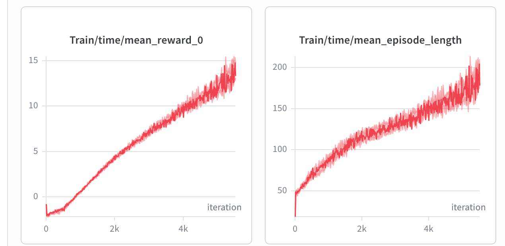

# 4. Distillation Is So Slow
Today the distillation step started. Why are the distillations going sooooo slow?

I wonder if this is the common practice.

6k iteration, man that is a lot, which means simply debugging one specific bug could take you 5 hours

I have to turn to people for help, and at the same time, think about what I can do first
