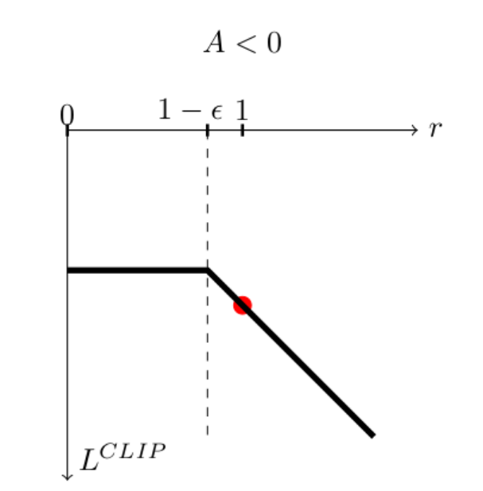

# PPO: proximal policy optimization


before we dive into the world of PPO, let's look at what is previously not efficient

```algorithm
\begin{algorithm}
\caption{On-Policy Actor--Critic (TD)}
\begin{algorithmic}
\STATE Initialize $\theta, \phi$
\FOR{each iteration}
    \STATE Collect trajectories using $\pi_\theta$
    \FOR{each $(s_t,a_t,r_t,s_{t+1})$}
        \STATE $y_t = r_t + \gamma V_\phi(s_{t+1})$
        \STATE $\delta_t = y_t - V_\phi(s_t)$
        \STATE Update critic by minimizing $(V_\phi(s_t)-y_t)^2$
        \STATE $\theta \leftarrow \theta + \alpha \nabla_\theta \log \pi_\theta(a_t|s_t)\,\delta_t$
    \ENDFOR
\ENDFOR
\end{algorithmic}
\end{algorithm}
```
vanilla policy gradient is inefficient because each gradient update ideally requires fresh data, which wastes samples if you only use them once.

so now in order to do multiple value update, we should notice that in a sample, you cannot do multiple policy update due to mismatch of sample and current policy:

$$
\begin{align}
\nabla J(\theta)
&= \mathbb{E}_{a \sim \pi_\theta(\tau)}
\nabla_\theta \log \pi_\theta(\tau)\, r(\tau)
\end{align}
$$

note that you can also write in trajectory

$$
\begin{align}
\nabla J(\theta)

&= \mathbb{E}_{\tau \sim p_\theta(\tau)}
\nabla_\theta \log p_\theta(\tau)\, r(\tau)
\end{align}
$$

the only difference is the layer, but they mean basically the same thing

## 1. importance sampling 

now you do gradient update multiple times, but the trajectory $\tau$ is still sample from the old policy $\pi_{old}$ instead of the $\pi_{new}$ now this is a serious **mismatch** of the policy parameter and the sample. in order to make the sample seemingly match the new polict $ \theta'$(prime ' denotes the next) we rewrite $\nabla J(\theta)$  as

$$
\begin{align}
J(\theta') 
&= \mathbb{E}_{\tau \sim p_{\theta'}} \left[r(\tau)\right] \\
&= \int p_{\theta'}(\tau)\, r(\tau)\, d\tau \\
&= \int p_\theta(\tau)\,
\frac{p_{\theta'}(\tau)}{p_\theta(\tau)}\,
r(\tau)\, d\tau \\
&= \mathbb{E}_{\tau \sim p_\theta}
\left[
\frac{p_{\theta'}(\tau)}{p_\theta(\tau)}
r(\tau)
\right].
\end{align}
$$

now you still sample from the $p_{old}$ but we have prove that you are doing exactly the same to $\theta'$.

The ratio $\frac{p_{\theta'}(\tau)}{p_\theta(\tau)}$ is called **Importance Weight**

And that means you can do it multiple times, too

```algorithm
\begin{algorithm}
\caption{Multi-Step Policy Gradient (Importance Sampling)}
\begin{algorithmic}
\STATE Initialize $\theta$
\FOR{each iteration}
    \STATE Collect trajectories $\tau$ using $\pi_{\theta_{\text{old}}}$
    \STATE Store old log-probabilities $\log \pi_{\theta_{\text{old}}}(a_t|s_t)$
    
    \FOR{$k = 1$ to $K$}   \COMMENT{multiple policy updates}
        \FOR{each $(s_t,a_t,A_t)$ in batch}
            \STATE Compute ratio:
            $\omega_t(\theta) =
            \dfrac{\pi_\theta(a_t|s_t)}
            {\pi_{\theta_{\text{old}}}(a_t|s_t)}$
            
            \STATE Update policy:
            $\theta \leftarrow
            \theta + \alpha \,
            \omega_t(\theta)\,
            \nabla_\theta \log \pi_\theta(a_t|s_t)\,
            A_t$
        \ENDFOR
    \ENDFOR
    
    \STATE $\theta_{\text{old}} \leftarrow \theta$
\ENDFOR
\end{algorithmic}
\end{algorithm}
```

## 2. Clipped gradient (PPO)
After this major revision for multiple gradient update, we can move on. However, problems occur if you update too aggressively, the new policy may assign much higher or much lower probability to the sampled actions. Then $r(\tau)$ becomes very large or very small.

$$
\begin{align}
L^{\text{CLIP}}(\theta')
&=J(\theta')\\
&=
\mathbb{E}_{\tau\sim{p_\theta(\tau)}}[min\omega(\tau)r(\tau),\omega_c(\tau)r(\tau)]

\end{align}
$$

where

$$
\begin{align}
\omega(\tau)=\frac{p_\theta'}{p_\theta}
\end{align}
$$

$$
\begin{align}
\omega_c(\tau) = \max \{ 1-\epsilon, \min \{ 1+\epsilon, \frac{p_{\theta'}}{p_{\theta}} \} \}
\end{align}
$$

the formula is not that intuitive, but the idea is to basically **CLIP** the gradient to be update.

Let's consider the reward to be negative, and then

Photo courtesy from [AI StackExchange](https://ai.stackexchange.com/questions/37608/why-clip-the-ppo-objective-on-only-one-side)

now you see: by this cutting, we enable the gradient to be within the range of [1-$\epsilon$,+$\infty$], however, it is not going to be +$\infty$ since the $L^{\text{CLIP}}(\theta')$ is very negative at the point, which the optimization will punish it and won't take any gradient to that. (we are doing gradient ascend if we have negative reward)